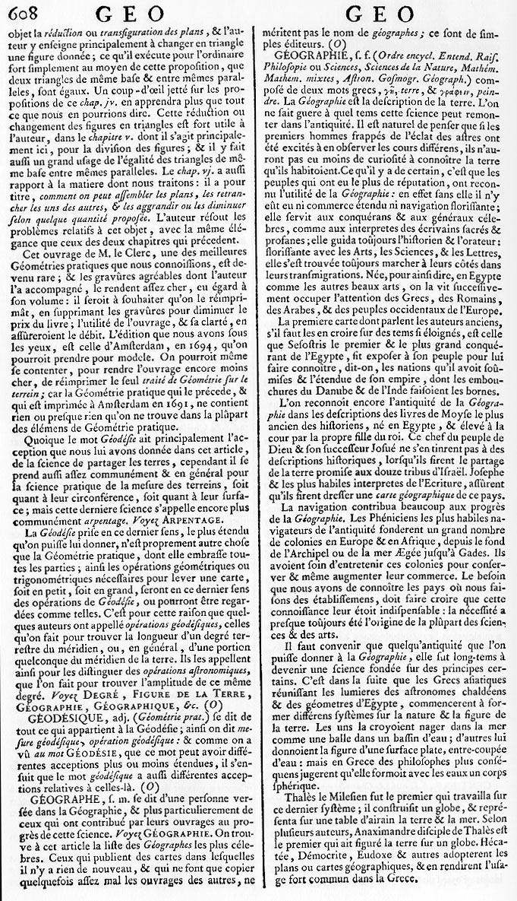
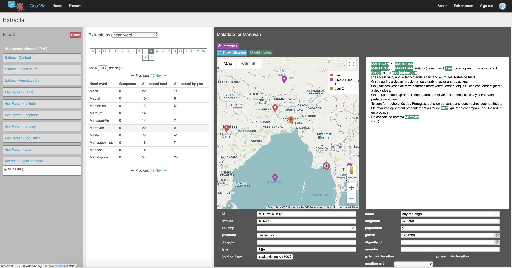

## Katherine McDonough, Ludovic Moncla, Matje van de Camp

### What's happening here?

This site shares work-in-progress on space and place in Diderot and d'Alembert's [Encyclopédie](https://artflsrv03.uchicago.edu/philologic4/encyclopedie1117/). We are a research collective experimenting on geographic information retrieval in reference texts from early modern France. We are one historian, one computer scientist, and one computational linguist.

Our work focuses on using new methods in Named Entity Recognition (NER) to interpret the spatial horizons of the *Encyclopédie ou Dictionnaire raisonné des sciences, des arts et des métiers, par une Société de Gens de lettres* (First Paris edition 1751-1772, in 17 volumes of text and 11 volumes of plates). There are 44,632 total text entries and 14,445 entries classified by the original editors as *Géographie*.

Initially we focused on developing a method for annotating the geographical information in the Encyclopédie. This work resulted in the [GeoViz](http://geoviz.taalmonsters.nl/) platform (created by Matje van de Camp). This annotation interface (not yet available publicly) permits researchers to view and edit geoparser XML output. Editing features include on-the-fly lookups of Geonames and DBpedia records matching place names in the text, differentiation of location types (real, historical, mythical/literary, sacred, extraterrestrial) and location positions relative to an article headword ("Paris is *contained within* France").

We used GeoViz to complete a set of gold standard annotations that helped to evaluate NER systems, since there is little to no information on the performance of these tools on early modern French texts. With this process now complete, we are both immersed in the texts of the Encyclopédie geography articles and aware of the current limitations of natural language processing for historical contexts. Foremost among these is the underlying assumption in NER that place names are entirely distinct from other entity types (people, for example) and that single- or multi-word place names can be extracted from their context without losing substantial meaning.

We wish to challenge these assumptions. In doing so we not only reshape the goals of automatic geographic information retrieval, we also experience historical geographical texts in a new environment.

Using a customized version of the NER and georesolution tool [PERDIDO](http://erig.univ-pau.fr/PERDIDO/), we set out to answer questions like:
- What are the "black holes" of geographic information in early modern reference works?
- How do authors structure the delivery of geographic information?
- What are the relationships between spatial information, people, ideas, and other entities (such as events, objects, or institutions)?
- How are rural spaces represented?
- How could we re-categorize geography subject articles based on their content (e.g. biographical) rather than their temporal or political status (modern, ancient, ecclesiastical, etc.)?

### Early Modern Geographical Information

> "Questions of spatiality – the geography of and in things, be they places,
peoples, books, ideas or representational procedures such as writing and
mapping – are, like questions of temporality and embodiment, ontological
fixtures. What may matter more in understanding questions of geography in
relation to the eighteenth century is the form taken by geography the subject
– geography as the practices by which the world was encountered and
inscribed in word and image and made real to its audiences (and the
relationships between these themes and the explanation of them). We can
then also address the interpretative significance that comes with thinking
geographically about intellectual history and the lived experience of the
eighteenth century."[^1]

This 2011 quotation from Charles Withers and Robert Mayhew captures two sides of the coin that often structure historical inquiries into geography - the geographical distribution of human activity and the invention of geographic science. Research often picks one or the other. In fact, as Withers and Mayhew suggest, these two approaches inform each other. Considering the ways that geography was publicized in printed media also requires understanding how knowledge was pieced together to make up these works. Our project examines the ways that space (as in, not only geographical places) is present in geographical texts, or, if you will, the spatiality of geographic writing during the early modern period.

### Extended Named Entities

In this stage of the project, we apply the concept of Extended Named Entities ([Moncla 2017](https://hal.archives-ouvertes.fr/hal-01492994/)) to collect contextual information about places named in the Encyclopédie. This development in Named Entity Recognition allows us to capture place-related information such as toponyms 1) embedded within other types of entities (official titles, institutions, objects, events), or 2) details extending from a named place that characterize or re-define a place ("la ville de Paris" vs. "une petite ville de France").

The examples of Extended Named Entities (ENE) below demonstrate our preliminary work to visualize first-order embedded entities. Before more complex plans to capture adjacent verbs, adverbs, and adjectives, this fairly simple technique already provides new insights into the functions of geographical information in the Encyclopédie.

### Examples



#### Recent and forthcoming publications:

(under review) Katherine McDonough, Ludovic Moncla, and Matje van de Camp, “Named Entity Recognition Goes to Old Regime France: Geographic Text Analysis for Early Modern French Corpora,” *International Journal of Geographical Information Science*, Special Issue: Spatial Computing for the Digital Humanities.

Katherine McDonough, “Putting the Eighteenth Century on the Map: A Proposal for Early Modern French Geospatial Data Development,” in *Digitizing Enlightenment*, ed. by Glenn Roe and Simon Burrows (Oxford Studies in the Enlightenment, 2019).

Katherine McDonough and Matje van de Camp, “Mapping the Encyclopédie: Geographic Text Analysis for the French Enlightenment,” *Proceedings: ACM SIGSPATIAL Workshop on Geospatial Humanities*, 7 November 2017.

#### Cite this work

McDonough, K., Moncla, L., & van de Camp, M. (2018). Spatial History of the *Encyclopédie*. Retrieved [insert the date you retrieved the information here without brackets] from http://kmcdono.com/enc.

#### Contact us

Contact [Katherine McDonough](https://library.stanford.edu/people/kmcdono2) by [email](kmcdono2@stanford.edu)  
Contact [Ludovic Moncla](https://lmoncla.ddns.net/) by [email](ludovic.moncla@insa-lyon.fr)



#### Footnotes

[^1]: Charles Withers and Robert Mayhew, "Geography: Space, Place and Intellectual History in the Eighteenth Century," *Journal for Eighteenth-Century Studies* 34, no. 4 (2011): 449.
